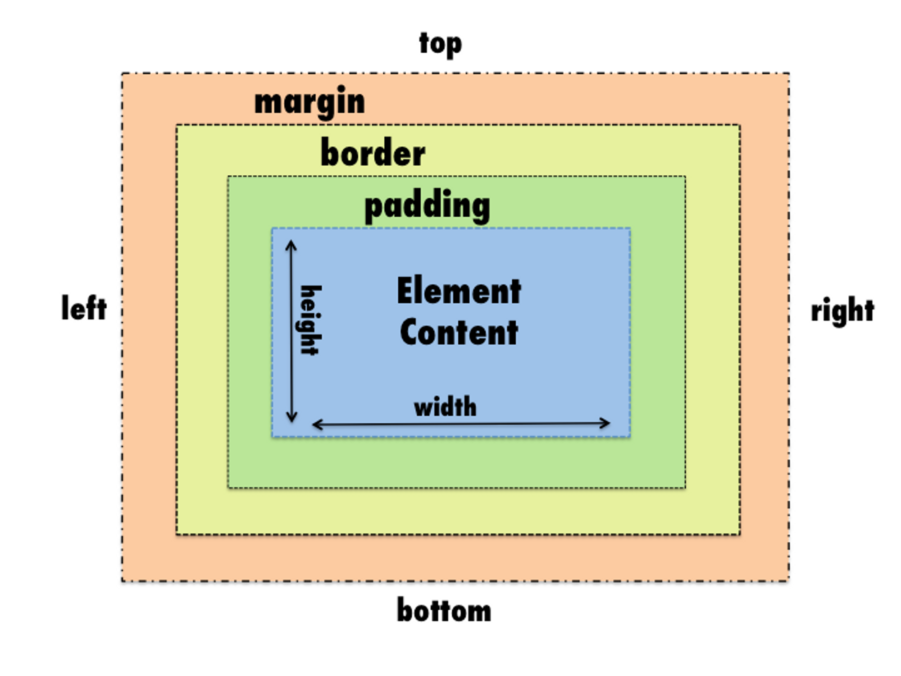
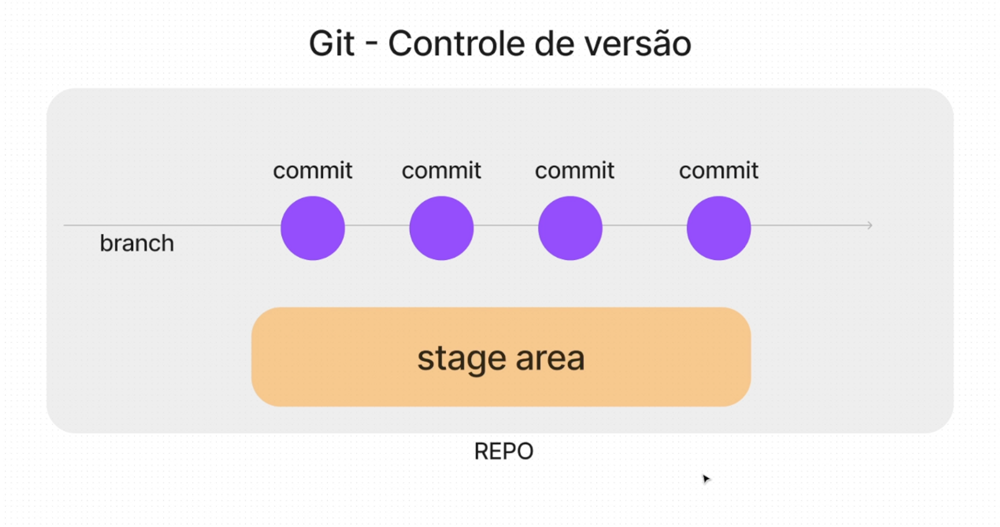

# HTML
- Hypertext Markup Language
- Estruturar textos, criar links, imagens, vídeo, etc...

## 1. Elemento HTML ou tag

- Existem inúmeras tags e cada uma deles irá servir para um determinado propósito. Ex.: imagem, texto grande, link, parágrafo, etc...
```html
<p>conteúdo</p>
<!-- Aqui vem um comentário -->
```

## 2. Attributes

- Adicionam informações e/ou configurações à uma tag
```html
<a href="https://rocketseat.com.br">Ver site</a>

```
observações:
>! + enter -> estrutura básica HTML
>
> `<a></a>` -> atributos  
>`||` -> ou  
>`{}` -> objeto vazio  
> `<!-- comentário html-->`


# CSS

- Estilos para o HTML
- Cascading Style Sheets
    
    Folha de Estilo em Cascata
    
- Apresentação visual para o cliente

## 1. Declarations

- Pedaço de código que irá ditar as propriedades e valores a serem aplicadas a um elemento HTML

```css
body {
  background: black;
	/* color: green; Essa linha será ignorada */
}
```
>`vh` -> viewport height  
>`/* comentario css */`  
## 2. Cascata
Quando há 2 (ou mais) declarações a última será mais relevante
```css
body {
  background: red;
}

body {
  background: blue;
}
```
## 3. Specificity

- Especificidade
    
    Cada seletor tem um peso e a soma dos pesos, será levada em conta para que determinada declaração seja mais específica
    

```css
#id {
  /* peso 100 */
}

.class {
  /* peso 10 */
}

element {
  /* peso 1 */
}

```

> *A cascata perde prioridade e é priorizada a especificidade da declaração*
> 

---

## 4. Box Model

- **Tudo são caixas**
    
    Todos os elementos HTML serão considerados uma caixa, assim como uma caixa de papelão
    
- **Caixas possuem determinadas propriedades**
    
    Conteúdo, Largura, Altura, Borda, Preenchimento (espaço interno), Espaçamento (espaço externo)



# JavaScript

É a logica de programação

```javascript
// comentário//  
```
A linguagem da WEB

---

## **O que é?**

- Linguagem de programação
    
    Interpretada e executada pelos navegadores
    
- A inteligência da tríade
    
    HTML é a estrutura, CSS é beleza e JS é a inteligência
    
- Não é JAVA
    
    Apesar do nome ser semelhante, são linguagens diferentes
    

---

## **Por que JS?**

- Aplicativos
    
    Para WEB, Desktop (Electron) e Mobile (React Native)
    
- Empresas famosas
    
    Instagram, Google, Netflix, TikTok …
    
- Moderna e Viva
    
    Comunidade e linguagem que cresce cada vez mais
    

---

## 1. Instruções e sintaxe

Toda linguagem é escrita com esses 2 princípios

- **Instruções** (declarações)
    
    Ordens ao computador
    
- **Sintaxe**
    
    Maneira correta de escrever
    

```jsx
const mensagem = "Bom te ver aqui! "

alert(mensagem + (10 * 100) + " abraços")

// Bom te ver aqui! 1000 abraços
```


>💡 Existem `palavras reservadas` da linguagem. 
Elas são responsáveis em dar significado a diversas instruções.


---

## **Executando JavaScript**

Podemos executar diretamente no Navegador

- Ferramenta `DevTools`
    
    Apertando o atalho `F12` no seu teclado
    
- Plataformas online
    
    [fronteditor.dev](https://fronteditor.dev)
    [codepen.io](https://codepen.io)
    
- Projeto no computador
    
    

---

## Projeto no computador

```html
<!-- em um arquivo index.html -->
<!-- importamos um arquivo .js no .html -->
<script src="./script.js"></script>
```

---

## 2. Variáveis e Tipos de dados

Facilitando as informações

---

### _Variáveis_

Uma caixinha onde guardamos um tipo de dado para usar mais tarde.


### _Tipos de dados_

Informações que podem ser em `textos`, `números`, `booleanos` (valores lógicos: verdadeiro ou falso) ou dados mais `estruturados`


```jsx
// declaro e atribuo valor
let boasVindas = 'Fala, Dev!';

// reatribuo valor
boasVindas = `Fala, Dev! Tudo beleza?!`;

// constante não pode mudar o valor
const serHumano = true;
serHumano = false // Erro!
```

---

## 3. Funções

- Agrupamento de código
- Reuso de código
- Mini programas dentro do programa maior
- Toda linguagem oferece muitas opções

```jsx
// usando uma função
alert('Fala, Dev!')

// criando uma função
function alert(text) {
	return text
}
```

---

## 4. Objetos


### _Tudo é objeto_

- Atributos
    
    São as propriedades de um objeto
    
- Métodos
    
    São as funcionalidades de um objeto
    


```jsx
// criando um objeto
const celular = {
  cor: 'preto',
  ligar: function() {
    const mensagem = "Ligando"
    alert(mensagem)
  } //método
}

// usando um objeto
  celular.cor //preto
  celular.ligar() //executa a função, usa parentesis pq é função
```

# DOM - Document Objet Model
É a modelagem dos nossos elementos HTML em Objeto JavaScript 

---

## Document

Posso controlar minha página, meu documento HTML, pelo JavaScript, através do objeto `document`

~~~javascript
document.querySelector("input").click() 
~~~
* querySelector ->
 pesquisar por seletor
* .algumacoisa ->
 executa no objeto antes do ponto

 # GIT
 
 ## O que é Git?

- Controle de versão
    
    Histórico do projeto
    
- Linha do tempo

---



---

## Conceitos básicos

- Repository
    
    Local onde ficará o histórico do seu projeto
    
- Branch
    
    Linha do tempo 
    
- Commit
    
    Pontos na história
    
- Stage
    
    Preparação do que será enviado para o ponto na história
    

---

## Comandos
```Json
// inicia o git (repositório) no seu projeto
git init 

// adiciona todos os arquivos modificados, ao stage
git add . 

// cria e descreve um ponto na história
git commit -m "message here" 

// envia alterações para o repositório remoto
git push
```

# GitHub
## O que é ?

- Plataforma online para colocar seus códigos
    
    através do Git
    
- Trabalhar em diversos projetos
    
    Profissional para colaborar em projetos ou trabalhar com times
    
- Perfil para mostrar seu trabalho
    
    Portfólio